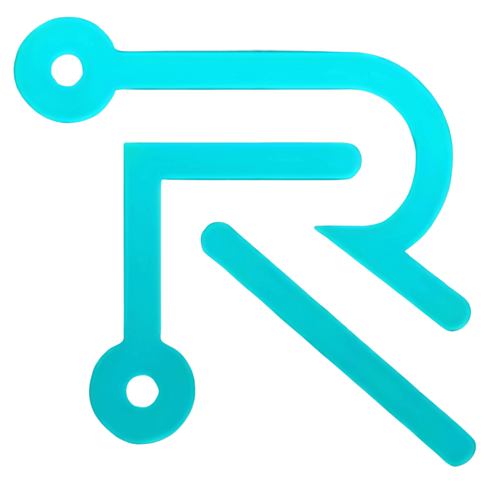
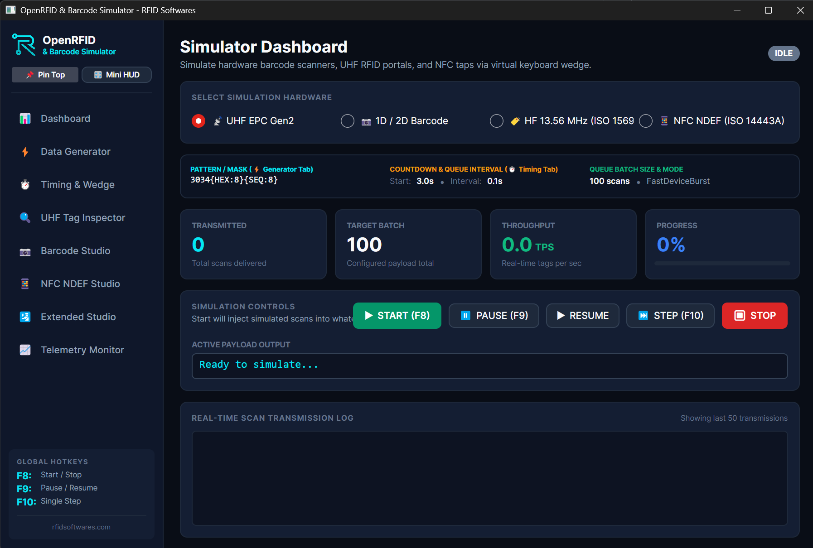
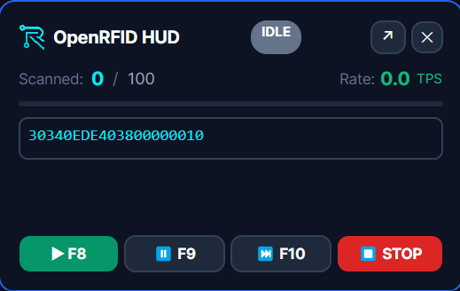
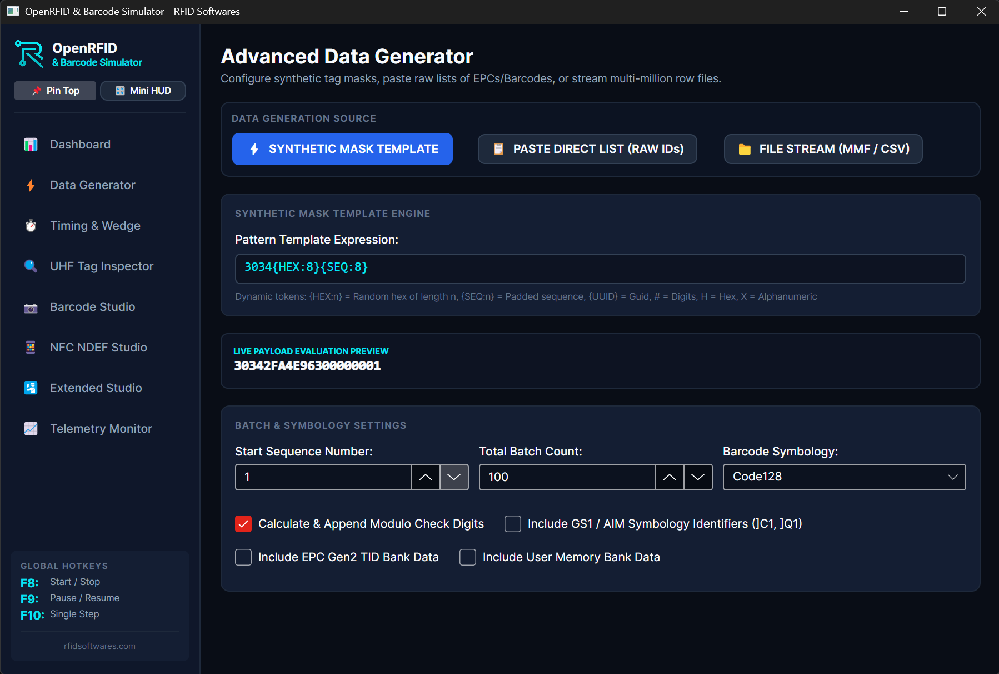
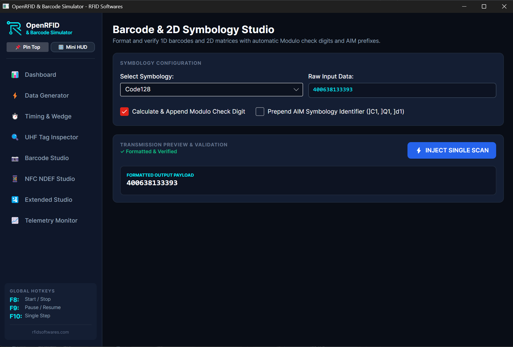
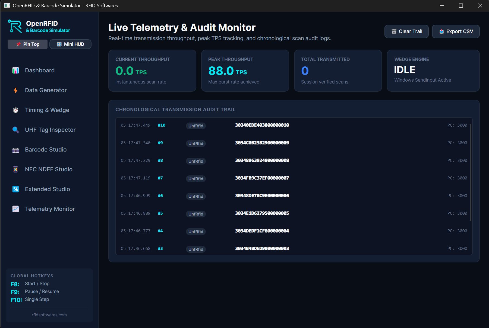

<div align="center">



# 📡 OpenRFID & Barcode Simulator
### Universal Virtual HID Keyboard Wedge & Hardware Protocol Simulator
**An Open-Source Project by [RFID Softwares](https://rfidsoftwares.com/)**

[](LICENSE)
[](https://rfidsoftwares.com/)
[](https://avaloniaui.net/)
[](https://rfidsoftwares.com/)

---

Simulate **1D/2D Barcode Scanners**, **HF RFID (13.56 MHz)**, **NFC (NDEF)**, **UHF RAIN RFID (EPC Gen2 / 860–960 MHz)**, **ICAO Doc 9303 MRZ Passports**, **Industrial Digital Scales (Mettler-Toledo / CAS)**, and **BLE Beacons (iBeacon & Eddystone)**. Feeds simulated tag and sensor reads into any web application, ERP, WMS, POS, or desktop software via sub-millisecond hardware keystrokes or human-like typing simulation.

[**Explore Enterprise Solutions ↗**](https://rfidsoftwares.com/) • [**Documentation**](SPECIFICATION_AND_ARCHITECTURE.md) • [**GitHub Releases ↗**](https://github.com/rfidsoftwares/open-rfid-barcode-simulator/releases)

</div>

---

## 📥 Direct Downloads (Portable • Zero-Install)

No runtime or installation required. Download and double-click to run immediately:

| Package / Binary | Target Platform | Description | Direct Download |
| :--- | :---: | :--- | :---: |
| **🚀 OpenRFID Desktop GUI** | Windows x64 | Full graphical studio with 8 simulator tabs & floating mini-HUD | [**Download .exe (92 MB)**](https://github.com/rfidsoftwares/open-rfid-barcode-simulator/releases/latest/download/OpenRFID-Simulator-UI.exe) |
| **⚡ OpenScanSim Headless CLI** | Windows x64 | High-throughput command-line tool for test automation & CI/CD | [**Download CLI .exe (67 MB)**](https://github.com/rfidsoftwares/open-rfid-barcode-simulator/releases/latest/download/openscansim-cli.exe) |
| **📦 Complete Portable Zip Package** | Windows x64 | GUI + CLI + Documentation + License in a single archive | [**Download .zip (69 MB)**](https://github.com/rfidsoftwares/open-rfid-barcode-simulator/releases/latest/download/OpenRFID-Simulator-v1.0.0-win-x64.zip) |

> **Portable Execution**: These are fully self-contained single-file native executables. You do not need .NET runtime installed.

---

## 📸 User Interface & Experience Gallery

| 1. Main Control Dashboard | 2. Floating Mini-HUD Widget |
| :---: | :---: |
|  |  |

| 3. Advanced Generator & Inspector | 4. Barcode Symbology & NFC Studio | 5. Live Telemetry & Noise Injector |
| :---: | :---: | :---: |
|  |  |  |

---

## 🚀 Key Features & Capabilities

- **Multi-Protocol Simulation**:
  - **1D/2D Barcode**: Code 128, Code 39, EAN-13, UPC-A, QR Code, Data Matrix, GS1-128 with `FNC1` group separators (`0x1D`) and AIM Symbology IDs (`]C1`, `]Q1`).
  - **HF RFID (13.56 MHz)**: ISO 15693 (Vicinity) & ISO 14443A (Mifare), 4/7/8-byte UID/CSN with configurable **MSB (Big-Endian)** / **LSB (Little-Endian)** byte ordering, DSFID, AFI, and user block memory.
  - **NFC (NDEF)**: NTAG213/215/216, full NDEF record encoding (URI `https://...`, Text, vCard MIME, Smart Poster, AAR).
  - **UHF RAIN RFID (860–960 MHz EPC Gen2)**: Complete 4-bank memory (Bank 00 Reserved Passcodes, Bank 01 EPC with PC Word & CRC-16, Bank 10 TID, Bank 11 User Memory).
  - **ICAO Doc 9303 Passport MRZ**: Full TD3 (2 lines x 44 chars) optical machine readable zone generation with 7-3-1 weighted check digit verification.
  - **Industrial Digital Scales**: Serial/HID stream emulation for Mettler-Toledo Continuous (`STX/Status/Weight/Tare`), CAS Standard, Avery Berkel, and NCI General formats.
  - **BLE Beacons**: Apple iBeacon 30-byte raw advertisement PDU synthesis and Google Eddystone-URL beacon framing.
- **Zero-RAM Streaming Generator**:
  - Lazily streams **millions of records** on-the-fly (`IAsyncEnumerable<ScanRecord>`) using strictly **< 30 MB RAM**.
  - Supports sequential counter increments, cryptographic random generation, template pattern masks (`3034{HEX:8}{SEQ:8}`), and memory-mapped file (MMF) streaming for 50M+ row CSV/TXT imports.
- **Two Keystroke Simulation Engines**:
  - **Fast Device Wedge Mode**: Ultra-fast Win32 `SendInput` batch burst (<8ms per 24-character EPC) mimicking physical USB HID scanners.
  - **Human Typing Mode**: Real-time human simulation with configurable typing speeds (60–180ms/char), Gaussian jitter, and optional typo corrections.
- **3-Tier Window & Focus-Safe Architecture**:
  - **Full Configuration Dashboard**: Complete setup and memory inspection.
  - **Always-on-Top Floating Mini-HUD**: Translucent `350x220px` widget with `WS_EX_NOACTIVATE` focus safety that never steals cursor focus from target web pages.
  - **Background System Tray Daemon**: Sits silently near the clock with instant global hotkeys (`F8` start/stop, `F9` pause, `F10` single test scan).
  - **Target Window Process Tracking**: Inspects top-level OS windows and locks injection to designated processes.
- **Chaos & Noise Injector (Fault Testing)**:
  - Injects simulated hardware faults (0.1%–10%): `NOREAD`, truncated barcode strings, CRC checksum inversion, tag collision jitter.

---

## 🛠 Technology Stack & Coding Standards

* **Language & Runtime**: C# 13 / .NET 8.0 LTS
* **GUI Framework**: Avalonia UI v11+ (Windows 11 Fluent Theme v2, Cross-Platform with Skia rendering)
* **Architecture Pattern**: Clean Architecture + MVVM (`CommunityToolkit.Mvvm`)
* **Input Injection**: Win32 `SendInput` (Windows) / `/dev/uinput` (Linux) / `CGEvent` (macOS)
* **Brand Theme**: RFID Softwares Design Tokens (`#2563EB` Primary Blue, `#090D16` Dark Slate, `#04E8F4` Cyan Accent)

---

## 🗺️ Sprint Execution Roadmap

| Sprint | Phase | Key Deliverables |
| :---: | :--- | :--- |
| **Sprint 1** | **Core Engine & Generators** | .NET Solution, `IAsyncEnumerable` lazy generators (Sequential, Mask, MMF), and Protocol validators (CRC-16, Modulo 10). |
| **Sprint 2** | **Native Wedge & High-Res Timers** | Win32 `SendInput` batch injector, `KEYEVENTF_UNICODE`, Gaussian jitter typing engine, `timeBeginPeriod(1)` 1ms clock, and global hotkeys (`F8`/`F9`/`F10`). |
| **Sprint 3** | **Avalonia Fluent Dashboard** | Windows 11 Fluent v2 dark theme, `MainWindow.axaml`, reader selector tabs, real-time hex payload preview, and MVVM bindings. |
| **Sprint 4** | **Floating Mini-HUD & Tray Daemon** | Compact `350×220px` floating widget with `WS_EX_NOACTIVATE` focus safety, circular countdown ring, and System Tray background daemon. |
| **Sprint 5** | **Barcode & NFC Studio + Telemetry** | 1D/2D symbologies with AIM IDs & FNC1, NFC NDEF builder (URI, Text, MIME), and live Throughput (TPS) telemetry monitor. |
| **Sprint 6** | **CLI, Tests & Release** | `OpenScanSim.Cli` headless runner (`openscansim`), automated browser testing with DOM verification, xUnit test suites. |
| **Sprint 7** | **Extended Auto-ID & Sensor Studio** | ICAO Doc 9303 Passport MRZ Studio, Industrial Digital Scale Wedge (Mettler-Toledo/CAS), BLE Beacons (iBeacon/Eddystone), Chaos Fault Injector, and HWND Process Tracker. |

---

## 🏢 About RFID Softwares

**OpenRFID & Barcode Simulator** is an open-source initiative sponsored and maintained by **[RFID Softwares](https://rfidsoftwares.com/)** (RFID Software India Private Limited).

* 🌐 **Website**: [https://rfidsoftwares.com/](https://rfidsoftwares.com/)
* 💼 **Solutions**: RFID Cloud Inventory, Directional Portal Systems, Warehouse WMS, Garment Tracking, Asset Tracking.
* 📞 **Contact**: +91 9791492742 | contact@rfidsoftwares.com
* 🔗 **LinkedIn**: [RFID Softwares on LinkedIn](https://www.linkedin.com/company/rfid-softwares)

---

## 📄 License

This project is open-source and licensed under the **[MIT License](LICENSE)**.

```
Copyright (c) 2026 RFID Software India Private Limited (https://rfidsoftwares.com/)
```

You are free to use, modify, distribute, and integrate this software in personal, commercial, and enterprise applications. Attribution to [RFID Softwares](https://rfidsoftwares.com/) must be preserved in all copies or substantial portions of the software.
